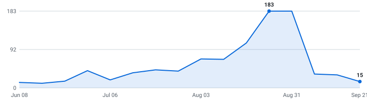

# 🎓 Summer 2027 Tech Internships — Singapore & Southeast Asia

**A self-updating engine that tracks tech internships so you don't have to.**

&nbsp;&nbsp;&nbsp;

### 73 open roles (56 listed below) · 71 new this week

4,401 employers tracked · data as of Sep 06, 2026 at 15:40 UTC

_17 have a cycle the employer stated · 56 are recent postings whose cycle isn't stated (listed separately, never mixed in)._

**[🖥️ Live dashboard](https://crunchybiscuit19.github.io/Automated-List-Of-Summer-2027-and-Fall-2026-Tech-Internships/)** · **[📡 RSS](https://crunchybiscuit19.github.io/Automated-List-Of-Summer-2027-and-Fall-2026-Tech-Internships/feed.xml)** · **[⚙️ JSON API](https://crunchybiscuit19.github.io/Automated-List-Of-Summer-2027-and-Fall-2026-Tech-Internships/api/jobs.json)** · **[✉️ Email alerts](https://crunchybiscuit19.github.io/Automated-List-Of-Summer-2027-and-Fall-2026-Tech-Internships/#subscribe)**

> [!TIP]
> **⭐ Star this repo** to save it and get updates when new roles are added.

Instead of refreshing a dozen career pages by hand, it reads company hiring feeds directly and keeps one live list — newest roles on top, refreshed automatically throughout the day.

**🔔 New roles in your inbox:** [subscribe by email](https://crunchybiscuit19.github.io/Automated-List-Of-Summer-2027-and-Fall-2026-Tech-Internships/#subscribe) - one email a day, only when new internships actually appeared, unsubscribe from any email in two clicks. (Prefer RSS-to-email? [Feedrabbit works too](https://feedrabbit.com/subscriptions/new?url=https%3A%2F%2Fraw.githubusercontent.com%2FCrunchyBiscuit19%2FAutomated-List-Of-Summer-2027-and-Fall-2026-Tech-Internships%2Fmain%2Fdocs%2Ffeed.xml).)

---

## What this is

This is an engine, not a hand-kept list. It polls company career feeds every 30 minutes, finds the internships, removes duplicates, and rebuilds this page on its own.

Every link comes straight from the source — so it's real and current, not a stale list someone forgot to update. Speed matters.

## What makes this different

| | |
|---|---|
| 🌏 **Built for Singapore & Southeast Asia** | Every role is filtered to the region above, from the posting's own location. Country-prefixed and city-only postings are both understood, so a bare "Kuala Lumpur" or "SG-Singapore" is never missed. |
| 📆 **A real date on nearly every role** | Taken from the job portal itself wherever the portal states one, so newest-first actually means newest. The exact coverage figure is printed at the bottom of this page every run. |
| 🧰 **Skill tags + pay, extracted** | Every posting's text is scanned for the stack it wants (Python, C++, PyTorch, …) and the pay it states — searchable on the [dashboard](https://crunchybiscuit19.github.io/Automated-List-Of-Summer-2027-and-Fall-2026-Tech-Internships/), and included in the CSV and API. |
| 🔔 **Alerts your way** | [Email digests](https://crunchybiscuit19.github.io/Automated-List-Of-Summer-2027-and-Fall-2026-Tech-Internships/#subscribe) or [RSS](https://crunchybiscuit19.github.io/Automated-List-Of-Summer-2027-and-Fall-2026-Tech-Internships/feed.xml) — point any reader, or a Slack/Discord RSS integration, at it. Plus a [live dashboard](https://crunchybiscuit19.github.io/Automated-List-Of-Summer-2027-and-Fall-2026-Tech-Internships/) with search, filters, and a saved-roles list that never leaves your browser. |
| ⚙️ **An engine, not a spreadsheet** | 4,651 job-board endpoints (4,401 distinct employers; some run more than one board) polled every 30 minutes across 12 ATS platforms. Full source and tests in this repo. |

## Scope

| | |
|---|---|
| **Roles** | Software Engineering, Data Science & Machine Learning (and closely related technical internships) |
| **Region** | Singapore & Southeast Asia |
| **Cycles** | Summer 2027 and Fall 2026 |

## About

I built this for the search I'm doing myself, so it tracks Singapore & Southeast Asia — that's where I'm applying. Everything is filtered from each posting's own stated location, and the same engine can be pointed at another region by editing one line of [`data/config.json`](data/config.json).

Use it to spot roles early and apply before they fill up. Being first genuinely helps.

## Where this is going

I'm building this in the open and adding to it as it grows.

**Recently shipped:** email alerts · the live dashboard · Singapore & Southeast Asia coverage

**Next up:** personalized alerts (pick your categories) · per-company hiring pages · a ghost-posting detector

If it helps you, a star means a lot and tells me to keep going.

## How to use

<b>Reading the table — flags, dates, and the cycle split</b> (click to expand)

- Roles are grouped by cycle below - **newest posting on top, oldest at the bottom.**
- A cycle section holds only roles whose **employer stated that cycle** - in the title, or in the posting's own text. Postings that name no cycle anywhere are in *Recently posted — cycle not stated* further down, with **no cycle guessed for them**. Same quality bar, different amount of evidence.
- The **Posted** column is the date the company published the role.
- **_(3 openings)_ after a role title** = the employer has that many separate live requisitions for the same job, in the same place, for the same cycle. They're all real and each takes its own application, so they're linked individually (**Apply**, then **#2**, **#3**) instead of repeating the row. Counts still count requisitions, and the CSV export is never grouped.
- **🆁 after a company name** = **this role is remote** — the posting's own location or title says so. It marks the role on that row, not the whole company.
- **🆕 after a role title** = spotted in the last 48 hours.
- **Work passes:** most roles here are open to students studying in the country concerned; in Singapore a non-resident intern normally needs a Work Holiday Pass or a Training Employment Pass, which the employer applies for. Postings rarely say either way, so confirm before you count on it.
- Track your applications with [`data/internships.csv`](data/internships.csv) (opens in Excel / Google Sheets).
- Missing a company? Adding one takes a single line, see [CONTRIBUTING.md](CONTRIBUTING.md).

---

## Summer 2027  (11 employer-stated)

| Company | Role | Category | Location | Skills | Posted | Apply |
|---|---|---|---|---|---|---|
| Mastercard | Software Engineer Intern, Summer 2027 - Singapore 🆕 | Software | Singapore | Python, Java, C#, JavaScript | Sep 04, 2026 | [Apply](https://mastercard.wd1.myworkdayjobs.com/Campus/job/Singapore/Software-Engineer-Intern--Summer-2027---Singapore_R-287574) |
| AppLovin | Mobile Engineering Intern (2027 Summer Internship) 🆕 | Software | Singapore | Java, Swift, Kotlin | Aug 25, 2026 | [Apply](https://boards.greenhouse.io/applovin/jobs/4708448006?gh_jid=4708448006) |
| AppLovin | Backend Engineering Intern (2027 Summer Internship) 🆕 | Software | Singapore | Python, Java, Linux, Kafka | Aug 25, 2026 | [Apply](https://boards.greenhouse.io/applovin/jobs/4708449006?gh_jid=4708449006) |
| Airwallex | Software Engineer Intern (Summer 2027) 🆕 | Software | SG - Singapore | Kotlin, LLMs, React, Kubernetes | Aug 05, 2026 | [Apply](https://jobs.ashbyhq.com/airwallex/6cdb0f39-234a-4234-b1f1-cb48a1fa2795) |
| Shopback 2 | Software Engineer Intern - Backend (H1 2027) 🆕 | Software | Singapore, Singapore | No skills listed | Aug 03, 2026 | [Apply](https://jobs.lever.co/shopback-2/1804a30e-2d2e-4631-9e85-614c91806ddf) |
| Hudson River Trading | Algorithm Development (Quant Research & Trading) Internship – Summer 2027 | Quant | London +5 more | Python, C++, MATLAB, Pandas | Jul 13, 2026 | [Apply](https://www.hudsonrivertrading.com/careers/job/?gh_jid=7964062) |
| Hudson River Trading | Software Engineering Internship (C++ or Python) – Summer 2027 | Software | Austin +11 more | Python, C++ | Jul 13, 2026 | [Apply](https://www.hudsonrivertrading.com/careers/job/?gh_jid=8052083) |
| Shopback 2 | Data Analyst (Internship) (H1 2027) 🆕 | Data & ML/AI | Singapore, Singapore | Python, SQL, LLMs | Jun 22, 2026 | [Apply](https://jobs.lever.co/shopback-2/b216d68c-48b0-4fa5-8f1e-9e0375b993e1) |
| Squarepoint Capital | Intern Software Developer - Singapore - 2027 🆕 | Software | Singapore | Python, Java, C++, Rust | Aug 28, 2024 | [Apply](https://www.squarepoint-capital.com/open-opportunities?id=6201998&gh_jid=6201998) |
| Virtu Financial | 2027 Internship – Software Engineer 🆕 | Software | Singapore | Python, Java, C++, JavaScript | Aug 31, 2021 | [Apply](https://job-boards.greenhouse.io/virtu/jobs/5513756002) |
| Virtu Financial | 2027 Internship - Quantitative Trading 🆕 | Quant | Singapore | Python, Java, C++, SQL | Apr 16, 2021 | [Apply](https://job-boards.greenhouse.io/virtu/jobs/5208637002) |

## Fall 2026  (4 employer-stated)

| Company | Role | Category | Location | Skills | Posted | Apply |
|---|---|---|---|---|---|---|
| Procter & Gamble (P&G) | Data Science Intern (Semester 2026) - P&G Management Internship Program - Bachelor's Degree or above 🆕 | Data & ML/AI | SINGAPORE GENERAL OFFICE | Python | Aug 16, 2026 | [Apply](https://pg.wd5.myworkdayjobs.com/1000/job/SINGAPORE-GENERAL-OFFICE/Data-Science-Intern--Semester-2026----P-G-Management-Internship-Program---Bachelor-s-Degree-or-above_R000157419) |
| Bosch | [Internship Program Q4] Embedded Software Intern (C/C++/Linux) 🆕 | Software | Ho Chi Minh, , Vietnam | C++, Python | Aug 13, 2026 | [Apply](https://jobs.smartrecruiters.com/BoschGroup/744000143206979) |
| Bosch | [Internship Program Q4] AI Engineer Intern 🆕 | Data & ML/AI | Ho Chi Minh, , Vietnam | Python, C++, PyTorch, TensorFlow | Aug 07, 2026 | [Apply](https://jobs.smartrecruiters.com/BoschGroup/744000142038898) |
| Bosch | [Internship Program Q4] DevOps Intern 🆕 | Software | Ho Chi Minh, , Vietnam | Python, Git | Aug 07, 2026 | [Apply](https://jobs.smartrecruiters.com/BoschGroup/744000142038969) |

## Recently posted — cycle not stated  (39 roles)

These postings never name a cycle — not in the title, not in the posting text — so neither do we. They're recent tech internships (posted within the last few weeks), often exactly the early drops worth applying to first; we just can't tell you which cycle they're for, and we'd rather say so than guess. The moment a posting's own text states a cycle, the role moves up into that section automatically.

| Company | Role | Category | Location | Skills | Posted | Apply |
|---|---|---|---|---|---|---|
| Bosch | [BD] AI Software QA Intern (Next-Gen & AI-Driven Testing / 6-month Internship) 🆕 | Data & ML/AI | Ho Chi Minh, , Vietnam | Python, TypeScript, SQL, LLMs | Sep 04, 2026 | [Apply](https://jobs.smartrecruiters.com/BoschGroup/744000147398230) |
| Bosch | [SX/BSV-VN] Embedded Test Engineer Intern 🆕 | Software | Ha Noi, , Vietnam | Python, Linux | Sep 04, 2026 | [Apply](https://jobs.smartrecruiters.com/BoschGroup/744000147458139) |
| Intel | Intern System Software Development Engineer 🆕 | Software | Malaysia, Penang | Python, C#, SQL, Angular | Sep 04, 2026 | [Apply](https://intel.wd1.myworkdayjobs.com/external/job/Malaysia-Penang/Intern-System-Software-Development-Engineer_JR0286937) |
| Tencent | Data Science Intern (Analytics), 6-month internship 🆕 | Data & ML/AI | Singapore-CapitaSky | Python, SQL, LLMs | Sep 04, 2026 | [Apply](https://tencent.wd1.myworkdayjobs.com/Tencent_Careers/job/Singapore-CapitaSky/Data-Science-Intern--Analytics---6-month-internship_R107974) |
| Thales | Software Development and Integration Engineer (Intern) 🆕 | Software | Singapore | Java, TypeScript, Angular, HTML/CSS | Sep 04, 2026 | [Apply](https://thales.wd3.myworkdayjobs.com/careers/job/Singapore/Software-Development-and-Integration-Engineer--Intern-_R0339158) |
| Bosch | [BD] OutSystems Developer Intern 🆕 | Software | Ha Noi, , Vietnam | JavaScript, LLMs | Sep 03, 2026 | [Apply](https://jobs.smartrecruiters.com/BoschGroup/744000147157559) |
| Western Digital | Internship - Software Development (Embedded) 🆕 | Software | Petaling Jaya, Selangor, Malaysia | Python, C++ | Sep 02, 2026 | [Apply](https://jobs.smartrecruiters.com/WesternDigital/744000146883869) |
| Thales | Software Engineer Intern - Middleware (IBS) 🆕 | Software | Singapore | Java, Swift, Kotlin | Sep 02, 2026 | [Apply](https://thales.wd3.myworkdayjobs.com/careers/job/Singapore/Software-Engineer-Intern---Middleware--IBS-_R0334782) |
| Tower Research Capital | Quantitative Researcher Intern, Bachelor's or Master's 🆕 | Quant | Singapore, Hong Kong, Shanghai, Sydney | Python, C++, Linux | Sep 01, 2026 | [Apply](https://www.tower-research.com/open-positions/?gh_jid=8168750) |
| Mufgub | Cybersecurity Awareness & Training Intern 🆕 | Security | Singapore Office OCC | No skills listed | Sep 01, 2026 | [Apply](https://mufgub.wd3.myworkdayjobs.com/MUFG-EarlyCareers/job/Singapore-Office-OCC/Cybersecurity-Awareness---Training-Intern_10078999-WD) |
| Intel | IFA Software Development Engineer Intern 🆕 | Software | Malaysia, Kulim | Python, C# | Aug 28, 2026 | [Apply](https://intel.wd1.myworkdayjobs.com/external/job/Malaysia-Kulim/IFA-Software-Development-Engineer-Intern_JR0286728) |
| Marinabaysands | Intern, Cyber Security 🆕 | Security | Marina Bay Sands, Singapore | No skills listed | Aug 28, 2026 | [Apply](https://marinabaysands.wd102.myworkdayjobs.com/external/job/Marina-Bay-Sands-Singapore/Intern--Cyber-Security_JR10000208) |
| Marinabaysands | Intern, Developer (Middleware) 🆕 | Software | Perennial Business City, Singapore | Java, SQL, Spring, Git | Aug 28, 2026 | [Apply](https://marinabaysands.wd102.myworkdayjobs.com/external/job/Perennial-Business-City-Singapore/Intern--Developer--Middleware-_JR10007967) |
| Marinabaysands | Intern, Developer A.I 🆕 | Software | Perennial Business City, Singapore | Python, Java, C#, JavaScript | Aug 28, 2026 | [Apply](https://marinabaysands.wd102.myworkdayjobs.com/external/job/Perennial-Business-City-Singapore/Intern--Developer-AI_JR10007970) |
| Razer | Applied AI Intern (Voice) 🆕 | Data & ML/AI | Singapore | Python, SQL, LLMs, Node.js | Aug 28, 2026 | [Apply](https://razer.wd3.myworkdayjobs.com/Careers/job/Singapore/Applied-AI-Intern--Voice-_JR2026007784) |
| Razer | Applied AI Intern 🆕 | Data & ML/AI | Singapore | Python, SQL, LLMs, Computer Vision | Aug 28, 2026 | [Apply](https://razer.wd3.myworkdayjobs.com/Careers/job/Singapore/Applied-AI-Intern_JR2026007785) |
| Swift | Site Reliability Engineering (SRE) Intern 🆕 | Software | Kuala Lumpur, Malaysia | Swift, Tableau | Aug 28, 2026 | [Apply](https://swift.wd3.myworkdayjobs.com/join-swift/job/Kuala-Lumpur-Malaysia/Site-Reliability-Engineering--SRE--Intern_2026-16467) |
| Trend Micro | GRID DEVOPS INTERN 🆕 | Software | Manila | No skills listed | Aug 27, 2026 | [Apply](https://trendmicro.wd3.myworkdayjobs.com/External/job/Manila/GRID-DEVOPS-INTERN_R0010148) |
| Hitachi Energy | Embedded Engineering Software Internship 🆕 | Software | Ho Chi Minh City, Ho Chi Minh, Vietnam | C++, Linux | Aug 26, 2026 | [Apply](https://hitachi.wd1.myworkdayjobs.com/hitachi/job/Ho-Chi-Minh-City-Ho-Chi-Minh-Vietnam/Embedded-Internship_R0142038) |
| Jump Trading | Campus AI/ML Researcher (Intern) 🆕 | Data & ML/AI | Hong Kong; Shanghai; Singapore | Python, C++, PyTorch, TensorFlow | Aug 24, 2026 | [Apply](https://www.jumptrading.com/hr/job?gh_jid=8027938) |
| Western Digital | Intern - AI Information Technology (Studying Master's and Bachelor Degree) 🆕 | Data & ML/AI | BangPa-in +2 more | Python, Java, C++, C# | Aug 24, 2026 | [Apply](https://jobs.smartrecruiters.com/WesternDigital/744000145156358) |
| Intel | Intern Systems Software Development Engineer 🆕 | Software | Vietnam, Ho_Chi_Minh_City | Python, C++ | Aug 21, 2026 | [Apply](https://intel.wd1.myworkdayjobs.com/external/job/Vietnam-Ho_Chi_Minh_City/Intern-Systems-Software-Development-Engineer_JR0286501) |
| Hitachi Energy | Embedded Software Engineer Internship 🆕 | Software | Da Nang, Đà Nẵng, Vietnam | C++, Linux | Aug 20, 2026 | [Apply](https://hitachi.wd1.myworkdayjobs.com/hitachi/job/Da-Nang--Nng-Vietnam/Embedded-Software-Engineer-Internship_R0142219) |
| Swift | Software/Systems Engineer - Intern 🆕 | Software | Kuala Lumpur, Malaysia | Java, JavaScript, Swift, HTML/CSS | Aug 20, 2026 | [Apply](https://swift.wd3.myworkdayjobs.com/join-swift/job/Kuala-Lumpur-Malaysia/Software-Systems-Engineer---Intern_2026-16387) |
| Tencent | Software Engineering Intern (Overseas AdTech Data Systems) 🆕 | Data & ML/AI | Singapore-CapitaSky | Java, AWS, Kubernetes, Docker | Aug 19, 2026 | [Apply](https://tencent.wd1.myworkdayjobs.com/Tencent_Careers/job/Singapore-CapitaSky/Software-Engineering-Intern--Overseas-AdTech-Data-Systems-_R108000) |
| Tower Research Capital | Quantitative Developer Intern 🆕 | Quant | Singapore | Python, C++, Bash, Pandas | Aug 18, 2026 | [Apply](https://www.tower-research.com/open-positions/?gh_jid=8138524) |
| Huntsman | Business Intelligence & AI Analytics Intern 🆕 | Data & ML/AI | Malaysia - Kuala Lumpur | SQL, LLMs, Databricks | Aug 18, 2026 | [Apply](https://huntsman.wd1.myworkdayjobs.com/Huntsman/job/Malaysia---Kuala-Lumpur/Business-Intelligence---AI-Analytics-Intern_J-020202) |
| Tencent | Cloud Engineer Intern 🆕 | Software | Singapore-CapitaSky | Python, PyTorch, LLMs, AWS | Aug 18, 2026 | [Apply](https://tencent.wd1.myworkdayjobs.com/Tencent_Careers/job/Singapore-CapitaSky/Cloud-Engineer-Intern_R107771) |
| Razer | Computer Vision Intern 🆕 | Data & ML/AI | Singapore Razer AI Center | Computer Vision, Python, PyTorch, TensorFlow | Aug 17, 2026 | [Apply](https://razer.wd3.myworkdayjobs.com/Careers/job/Singapore-Razer-AI-Center/Computer-Vision-Intern_JR2026007731) |
| PatSnap | Full Stack Intern (AI & Web Development) 🆕 | Data & ML/AI | Singapore, Central Singapore, Singapore | React, Vue, Spring | Aug 15, 2026 | [Apply](https://careers.patsnap.com/o/full-stack-intern-ai-web-development) |
| DRW | Software Engineer Intern (Data Engineering) 🆕 | Data & ML/AI | Singapore | Python, Pandas, Kubernetes, PostgreSQL | Aug 13, 2026 | [Apply](https://job-boards.greenhouse.io/drweng/jobs/8127242) |
| Continental | IT Internship - Process Automation & Software Development 🆕 | Software | Petaling Jaya, Selangor, Malaysia | Python, Git | Aug 10, 2026 | [Apply](https://jobs.smartrecruiters.com/Continental/744000142562964) |
| Dentsu | Data Analyst Intern 🆕 | Data & ML/AI | Jakarta | Python, SQL | Aug 10, 2026 | [Apply](https://dentsuaegis.wd3.myworkdayjobs.com/DAN_GLOBAL/job/Jakarta/Data-Analyst-Intern_R1129197) |
| Jump Trading | Campus Quantitative Researcher (Intern) 🆕 | Quant | Singapore | Python, C++ | Aug 03, 2026 | [Apply](https://www.jumptrading.com/hr/job?gh_jid=8027939) |
| Jump Trading | Campus Quantitative Trader (Intern) 🆕 | Quant | Singapore | No skills listed | Aug 03, 2026 | [Apply](https://www.jumptrading.com/hr/job?gh_jid=8027941) |
| Western Digital | Intern Firmware Engineering 🆕 _(3 openings)_ | Hardware | Petaling Jaya, Selangor, Malaysia | Python, C++ | Aug 03, 2026 | [Apply](https://jobs.smartrecruiters.com/WesternDigital/744000141227773) [#2](https://jobs.smartrecruiters.com/WesternDigital/744000141229499) [#3](https://jobs.smartrecruiters.com/WesternDigital/744000141840819) |
| Xendit | Full Stack Developer Intern 🆕 | Software | Jakarta, Indonesia | TypeScript, JavaScript, SQL, React | Jul 30, 2026 | [Apply](https://job-boards.greenhouse.io/xendit/jobs/7821207003) |
| Xendit | Data / ML Automation Intern 🆕 | Data & ML/AI | Jakarta, Indonesia | Python, TypeScript, SQL, PyTorch | Jul 30, 2026 | [Apply](https://job-boards.greenhouse.io/xendit/jobs/7821208003) |
| Simular | Data Analyst Intern 🆕 | Data & ML/AI | Singapore | Python, SQL, dbt | Jul 29, 2026 | [Apply](https://jobs.ashbyhq.com/simular/7147a575-c7da-44d3-a6d6-2cdd4d24b94a) |

<strong>Recently closed</strong> — 40 roles that left the list in the last 14 days

_Why each one left is in the last column, because the two reasons carry different evidence. **Gone from feed** = two consecutive complete reads of the employer's board no longer returned it (strong, but not the employer telling us directly). **Out of scope** = still posted, but it no longer passes our filters — our call, not theirs. **Not recorded** = closed before we started tracking the reason._

| Company | Role | Cycle | Closed | Why |
|---|---|---|---|---|
| Amazon | Software Development Engineer Intern, AWS Data Services - Fall 2026 (US) | Fall 2026 | 2026-09-06 | out of scope |
| Amazon | Robotics - Software Development Engineer Fall Intern/Co-op - 2026 | Fall 2026 | 2026-09-06 | out of scope |
| Amazon | Software Development Engineer Intern, Annapurna Labs - 2027 | Summer 2027 | 2026-09-06 | out of scope |
| Amazon | Robotics - Applied Scientist II Intern / Co-op - 2026 (Robotics, Manipulation, Perception, Motion Planning, Autonomous Mobile Robots, Computer Vision, Machine Learning, Controls, and more) | Fall 2026 | 2026-09-06 | out of scope |
| Beacon Software | Software Engineering Intern | Fall 2026 | 2026-09-06 | out of scope |
| Ellipsis Labs | Software Engineer - 2027 Interns | Summer 2027 | 2026-09-06 | out of scope |
| Hadrian | Software Engineer Intern | Fall 2026 | 2026-09-06 | out of scope |
| Hadrian | Data Science/ Data Engineer Intern | Fall 2026 | 2026-09-06 | out of scope |
| Heliux | Software Engineer (Internship, Summer 2027) | Summer 2027 | 2026-09-06 | out of scope |
| Junior | Software Engineering Intern — Fall 2026 | Fall 2026 | 2026-09-06 | out of scope |
| Melius | Software Engineering Intern [Fall/Winter 2026] | Fall 2026 | 2026-09-06 | out of scope |
| Melius | Software Engineering Intern [Spring/Summer 2027] | Summer 2027 | 2026-09-06 | out of scope |
| Northwood Space | Software Engineering Intern (2027 Summer Internship) | Summer 2027 | 2026-09-06 | out of scope |
| Northwood Space | Embedded Software Engineering Intern (2027 Summer Internship) | Summer 2027 | 2026-09-06 | out of scope |
| Notion | Software Engineer Intern (Summer 2027) | Summer 2027 | 2026-09-06 | out of scope |
| Phoebe | Software Engineering Intern | Fall 2026 | 2026-09-06 | out of scope |
| Quadrillion | Software Engineering Intern (Summer 2027) | Summer 2027 | 2026-09-06 | out of scope |
| Rivet Industries | Software Engineer Intern, XR Team (Fall 2026) | Fall 2026 | 2026-09-06 | out of scope |
| The Voleon Group | Software Engineer Intern - (Summer 2027) | Summer 2027 | 2026-09-06 | out of scope |
| Wavetronix | Computer Science Internship Summer 2027 | Summer 2027 | 2026-09-06 | out of scope |
| Advanced Space | 2027 Software Engineering Summer Internship | Summer 2027 | 2026-09-06 | out of scope |
| Advanced Space | 2027 Machine Learning Summer Internship | Summer 2027 | 2026-09-06 | out of scope |
| Advanced Space | 2027 DevOps Summer Internship | Summer 2027 | 2026-09-06 | out of scope |
| Akuna Capital | Software Engineer Intern - C++, Summer 2027 | Summer 2027 | 2026-09-06 | out of scope |
| Akuna Capital | Software Engineer Intern - Python, Summer 2027 | Summer 2027 | 2026-09-06 | out of scope |
| Akuna Capital | Platform Engineer Intern, Summer 2027 | Summer 2027 | 2026-09-06 | out of scope |
| Akuna Capital | Software Engineer Intern - C# .NET Desktop, Summer 2027 | Summer 2027 | 2026-09-06 | out of scope |
| Akuna Capital | Software Engineer Intern - Full Stack Web, Summer 2027 | Summer 2027 | 2026-09-06 | out of scope |
| Akuna Capital | Quantitative Research Intern, Summer 2027 | Summer 2027 | 2026-09-06 | out of scope |
| Anduril | 2027 Software Engineer Intern | Summer 2027 | 2026-09-06 | out of scope |
| Appian | Software Engineering Intern | Summer 2027 | 2026-09-06 | out of scope |
| Appian | Information Security Engineer Intern | Summer 2027 | 2026-09-06 | out of scope |
| Awetomaton | Platform Engineering Intern | Summer 2027 | 2026-09-06 | out of scope |
| Axon | 2027 US Firmware Engineering Internship | Summer 2027 | 2026-09-06 | out of scope |
| BTI360 | Software Engineering Intern | Summer 2027 | 2026-09-06 | out of scope |
| Charles River Associates (CRA) | (2028 Bachelor's/Master's graduates) Cyber and Forensic Technology Consulting Analyst/Associate Intern (Summer 2027) | Summer 2027 | 2026-09-06 | out of scope |
| Chicago Trading Company | Quant Trading Internship - Summer 2027 | Summer 2027 | 2026-09-06 | out of scope |
| Chicago Trading Company | Software Engineering Internship - Summer 2027 | Summer 2027 | 2026-09-06 | out of scope |
| Dev Technology Group | AI/ML Intern (Summer 2027) | Summer 2027 | 2026-09-06 | out of scope |
| Dev Technology Group | React/Node Developer Intern (Summer 2027) | Summer 2027 | 2026-09-06 | out of scope |

---

## Hiring timeline

Internships posted per week, from each role's real published date - redrawn automatically on every run. When this line takes off, recruiting season is open:

<picture>
  <source media="(prefers-color-scheme: dark)" srcset="docs/trends-dark.svg">
  
</picture>

## How it stays current

A small Python engine reads public company hiring feeds directly, keeps the roles that match the scope above, de-duplicates across sources, records each role's published date once (so it never shifts), and regenerates this page through GitHub Actions. It polls every company concurrently (async) with retry/backoff and per-host rate limits. The full source is in this repo.

_Engine (last run): 4,239 of 4,651 registered boards returned successfully across 12 ATS platforms (96% of boards attempted, 91% of the full registry) · completed in 1008.7s · 565 board(s) returned a capped result set, so their roles were not eligible to be closed this run · employer or source-derived date on 100% of open roles._

## How this list is built

[METHODOLOGY.md](METHODOLOGY.md) documents exactly what every label claims — what separates a stated cycle from an inferred one, what the ✓ H-1B badge does and doesn't mean, how a role gets closed, and which limitations are known. Anything on this page that doesn't match the code is a bug worth reporting.

## Contributing

Adding a company takes one line, see [CONTRIBUTING.md](CONTRIBUTING.md), or just [open a request](../../issues/new?template=add-company.yml) with the board URL. **Spotted something wrong?** [Report the exact field](../../issues/new?template=wrong-data.yml) — wrong country, wrong cycle, closed role, bad sponsorship flag. Those reports usually fix a rule, which fixes every other role too.

Also here: [PRIVACY.md](PRIVACY.md) (what the email list stores — an address and nothing else) · [SECURITY.md](SECURITY.md) · [ARCHITECTURE.md](ARCHITECTURE.md) · [MIT licensed](LICENSE).

Built by one student with AI assistance, in the open. The part that matters isn't who typed it — it's that the rules, the tests, and every run's output are all public and checkable.

## Note on dates

The **Posted** column shows when a role was published, with the newest at the top. I pull the posting date straight from each job portal, but a lot of them don't expose one publicly, so those rows show a dash (—) for now instead of a guessed date. The ones that do publish a date are dated. Know the real date for a dashed role? Open a PR and I'll merge it.

Roles can close at any time, so always confirm on the company's own site before applying.
